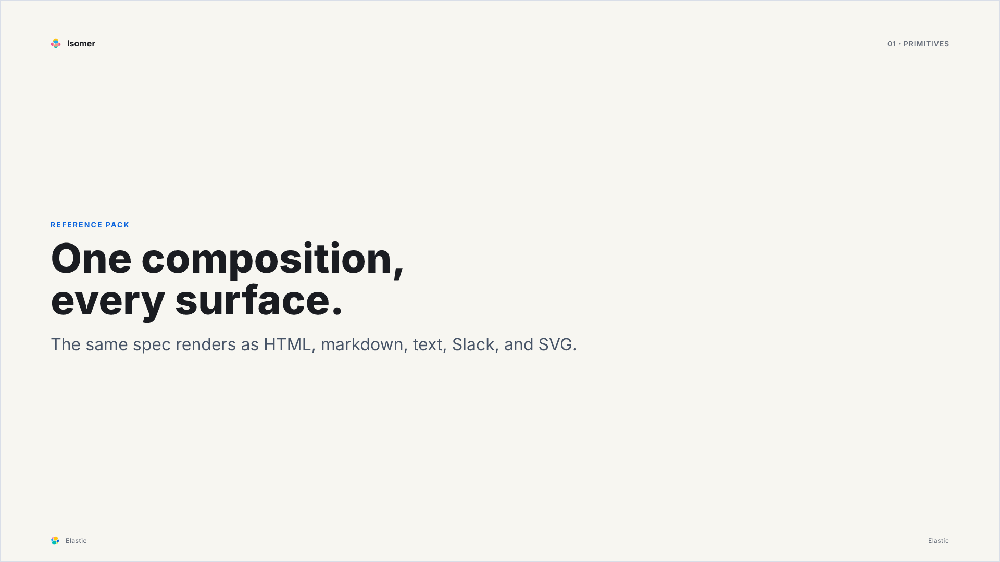

<!-- markdownlint-disable MD033 -->
<p align="center">
  
</p>
<h1 align="center">@elastic/isomer</h1>
<p align="center"><strong>isomer</strong> <i>n.</i> — one formula, many forms; the same composition rendered to every surface.</p>
<p align="center">
  <a href="https://www.npmjs.com/package/@elastic/isomer"></a>
  <a href="https://github.com/elastic/isomer/actions/workflows/ci.yml"></a>
  <a href="https://github.com/elastic/isomer/blob/main/LICENSE.txt"></a>
</p>
<!-- markdownlint-enable MD033 -->

# Isomer

Isomer turns one typed `Composition` into React, HTML, SVG, PNG, Slack Block Kit, Markdown, and plain text. It owns the composition contract, the primitive catalog, validation, and rendering. Hosts own data, authorization, routing, and side effects.

## Why

A product answers the same question in more than one place: a page, a Slack message, an agent's reply, an image in an email. Each channel usually gets its own renderer, and they drift. Isomer moves the shared part into one document. A host, or an agent handed the pack's JSON Schema and catalog, composes the answer once from a vocabulary of primitives. Isomer validates it and renders it to every channel, degrading through Markdown and plain text so nothing silently disappears.

[What is Isomer?](https://elastic.github.io/isomer/) tells the whole story: the vocabulary, the two paths a composition arrives by, what happens inside a render, and what a consumer can rely on.

## One composition, three ways

The reference pack's title slide is one composition. These are its committed outputs, written by the same test on every run.

The `svg` surface, rasterized to PNG:



The `markdown` surface:

```markdown
# Title slide

## 01 · Primitives

_Reference pack_

## One composition, every surface.

The same spec renders as HTML, markdown, text, Slack, and SVG.
```

The `text` surface:

```text
TITLE SLIDE

01 · Primitives

Reference pack
One composition, every surface.
The same spec renders as HTML, markdown, text, Slack, and SVG.
```

Slack gets a `header` block and one `mrkdwn` section, and HTML gets a `section.isomer` with only the CSS the slide uses. Every output of every example is in the [reference pack's examples](packages/isomer-primitives-slides/docs/example.md).

## Two ways a composition is made

**The product path.** Code owns the composition. A team registers a view with `defineView`: a stable id, the questions it answers, a Zod input schema, and a builder that fetches data and returns a composition. A host requests it by id, and the registry validates the input before the builder runs and the result after. Nothing model-authored touches this path.

**The agent path.** A model owns the composition. The runtime hands it the authoring context: a JSON Schema projected from the same Zod schemas the validator uses, the catalog with one example per primitive, and the registered views it may request instead. The host parses what comes back, feeds errors back for a retry, and renders only what validates.

## A first composition

A primitive is a schema, a catalog entry an agent reads, and one renderer per surface. A pack is a list of primitives. A runtime turns packs into surfaces.

```ts
import { definePrimitive, definePrimitivePack, z } from '@elastic/isomer-sdk';
import { createIsomerRuntime } from '@elastic/isomer-runtime';

const metric = definePrimitive({
  type: 'metric',
  schema: z.object({ type: z.literal('metric'), label: z.string(), value: z.string() }),
  catalog: {
    type: 'metric',
    purpose: 'State one measured value.',
    useWhen: ['A single number answers the question.'],
    avoidWhen: ['Several values belong together.'],
    example: { type: 'metric', label: 'Error rate', value: '0.4%' },
  },
  examples: [{ type: 'metric', label: 'Error rate', value: '0.4%' }],
  renderers: {
    react: (node) => `${node.label}: ${node.value}`,
    text: (node) => `${node.label}: ${node.value}`,
    markdown: (node) => `**${node.label}**: ${node.value}`,
  },
});

const runtime = createIsomerRuntime({
  packs: [definePrimitivePack({ id: 'ops', primitives: [metric] })],
});

const composition = {
  type: 'view',
  title: 'Checkout',
  body: [
    { type: 'metric', label: 'Error rate', value: '0.4%' },
    { type: 'metric', label: 'P99 latency', value: '210 ms' },
  ],
};

runtime.validate(composition); // { valid: true, errors: [], warnings: [] }
runtime.surfaces.text.render(composition);
runtime.surfaces.markdown.render(composition);
runtime.surfaces.slack.render(composition).blocks;
runtime.surfaces.html.render(composition).html;
runtime.getAuthoringContext(); // { schema, primitives, views, … } for an agent
```

Slack gets its blocks through the Markdown fallback, because the pack wrote no Slack renderer. Supply a frame and the `svg` surface appears, ready for a rasterizer. The `html` surface reports validation findings on its result; `text`, `markdown`, `slack`, and `svg` throw on an invalid composition by default; `react` never validates.

## Which package

| You want to | Start with |
| --- | --- |
| Render compositions in a host: a Kibana plugin, a Slack bot, an MCP server | [`@elastic/isomer-runtime`](packages/isomer-runtime/README.md), then its [quick start](packages/isomer-runtime/docs/quick-start.md) |
| Write primitives, a theme, or a frame | [`@elastic/isomer-sdk`](packages/isomer-sdk/README.md), then its [quick start](packages/isomer-sdk/docs/quick-start.md) |
| Copy a working pack | [`@elastic/isomer-primitives-slides`](packages/isomer-primitives-slides/README.md), the in-repo reference pack |
| Turn the `svg` surface into PNG | [`@elastic/isomer-image-takumi`](packages/isomer-image-takumi/README.md) |
| Score what a model composes from your pack | [`@elastic/isomer-evals`](packages/isomer-evals/README.md) |

Every package publishes together at one version: the two a host installs, the reference pack to copy from, a host-side rasterizer, and a harness a pack author runs against their own runtime.

## Development

```sh
corepack enable
pnpm install
pnpm verify
```

`pnpm verify` is the full local gate, and CI runs the same command. [CONTRIBUTING.md](CONTRIBUTING.md) lists what it checks, and [AGENTS.md](AGENTS.md) holds the conventions and invariants, written for a human contributor and a coding agent alike.

## License

[](LICENSE.txt)

Source available under the Elastic License 2.0 (SPDX: `Elastic-2.0`). See [LICENSE.txt](LICENSE.txt).
