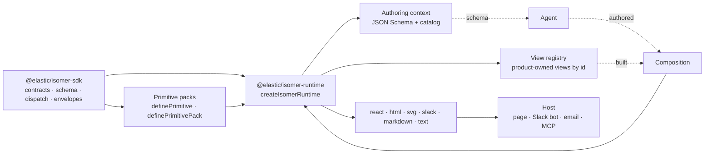

# What is Isomer?

A product answers the same question in more than one place: a page, a Slack message, an agent's reply, an image in an email. Each channel usually gets its own renderer, and they drift. Isomer moves the shared part into one typed document, a `Composition`, and renders that document to React, static HTML, SVG for rasterization, Slack Block Kit, Markdown, and plain text.

The line it draws is deliberate. Isomer owns the composition contract, the primitive catalog, validation, and rendering. The host owns data, authorization, routing, and side effects. That line is what lets an agent author a composition from a JSON Schema and a catalog while the host validates and renders the result without trusting the agent with anything but layout.

## The vocabulary

- **Composition.** The wire document: `{ type: 'view', title?, subtitle?, body: Node[] }`. It says what the answer is, never how it looks. The discriminator stays `type: 'view'` on the wire; the TypeScript name is `Composition`.
- **Primitive.** One node type: a Zod schema, a catalog entry an agent reads (purpose, when to use, when not to, an example), examples, and one renderer per surface. `react`, `text`, and `markdown` are mandatory; `slack` is optional and falls back through Markdown; there is no `svg` renderer because the image surface reuses `react`.
- **Pack.** A vocabulary as a value: an id, primitives, optionally a stylesheet adapter and a theme requirement. Packs compose; duplicate types are rejected by name.
- **Runtime.** Packs and optional frames assembled into one validator, one parser, a surface per output format, a view registry, and the payload an agent authors against.
- **Frame.** The document an image is drawn inside: width, height estimation, theme, and the surround. Without a frame the runtime has no `svg` surface, and its type says so.
- **Surface.** One output format with two methods, `render` for a composition and `renderNode` for a single node. Every surface is synchronous.

## How it works

A composition is made one of two ways, and the runtime treats them differently.

### The product path

Code owns the composition. A team registers a view with `defineView({ id, title, answers, input, build })`: a stable id, a Zod input schema, and a builder that fetches data and returns a composition. A host requests it by id, the registry validates the input, runs the builder, and validates the result. Nothing model-authored touches this path. See [View registry](runtime/view-registry.md).

### The agent path

A model owns the composition. The runtime hands it `getAuthoringContext()`: a JSON Schema projected from the same Zod schemas the validator uses, the catalog with one example per primitive, and the list of registered views it may request instead. The host runs `parse` on what comes back, feeds errors back for a retry, and renders only what validates. See [Authoring context](runtime/authoring-context.md).

### Inside a render

1. **Validate.** The schema is a discriminated union over every primitive the runtime holds, rebuilt per vocabulary so a container's child slot references the same union. Semantic passes follow: duplicate node ids, empty surfaces, missing image heights when a frame measures nodes. Errors are `{ path, message }`, worded for a model to act on.
2. **Dispatch.** One dispatcher keyed by node type routes each node to its primitive's renderer for the requested surface, running the primitive's `sanitize` hook first. A node hidden from a surface, or a primitive with no Slack renderer, degrades rather than disappears.
3. **Envelope.** Each surface wraps the body: a heading and a `section.isomer` for HTML and React, an `h1` for Markdown, an uppercase title for text, a `header` block for Slack, a frame for images.
4. **Styles.** A pack contributes CSS through a style adapter. The HTML and image surfaces render once to collect the class names a composition actually uses, then emit only that stylesheet, so a page or a rasterizer never carries the whole pack's CSS.

## What ships

| Package | Role |
| --- | --- |
| [`@elastic/isomer-sdk`](sdk/index.md) | The contracts everything else is written against: `definePrimitive`, `definePrimitivePack`, the composition schema, validator and parser, the dispatcher, per-surface envelopes, URL trust, the JSX and object-builder authoring fronts, the agent prompt builder, and a conformance harness for packs. Subpath entries keep `react-dom` off everything but HTML rendering, so a Slack bot never loads it. |
| [`@elastic/isomer-runtime`](runtime/index.md) | Assembles packs and frames into a runtime: validate, parse, the surfaces, the view registry, renderer overrides, and the authoring context. One entry point, no Node built-ins, runs in a browser, a server, or an edge function. |
| [`@elastic/isomer-primitives-slides`](slides/index.md) | The reference pack, and the one to copy: slide-deck primitives, a theme with one authoring source per rendered value, a fixed 16:9 frame, and committed PNG output for every example. |
| [`@elastic/isomer-image-takumi`](image-takumi/index.md) | Turns the `svg` surface's element and stylesheet into PNG or SVG bytes with Takumi. Declares the input shape structurally, so it depends on no Isomer package. |
| [`@elastic/isomer-evals`](evals/index.md) | A harness a pack author runs against their own runtime: how often a model's compositions parse, validate, recover on retry, pick the right primitives, and answer the question. Runs with no credentials on a replayed corpus. |

Every package publishes together at one version. A host installs the SDK and the runtime. The reference pack is there to copy from or to render slide decks with, the rasterizer is added by a host that draws images, and the eval harness is something a pack author runs against their own runtime.

**Peers.** The SDK and the runtime need `react` and `zod`. The runtime also needs `react-dom`, because its single entry constructs the HTML surface and that surface renders through `react-dom/server`; the SDK marks `react-dom` optional and confines it to its `./html` entry.

## What a consumer can rely on

- **Every composition degrades.** Three renderers are mandatory per primitive, so a composition authored for a page always has a text and a Markdown form, and Slack falls back through Markdown when a primitive has no Block Kit renderer.
- **Validation has one posture per surface.** `html` renders and reports findings on `validationErrors`, because a partial document is still worth showing. `text`, `markdown`, `slack`, and `svg` throw `CompositionValidationError` on invalid input by default, because a string, a message about to be posted, or an image has nowhere to carry findings. `react` never validates; it is the interactive target where a partial render beats an exception. `onValidationError` flips any of them.
- **Untrusted input is parsed, trusted input is validated.** `parse` is the schema alone, for model output. `validate` adds the semantic passes, for compositions code built. Node schemas are closed to unknown keys, and a wrong type reports as a wrong type, not a missing field.
- **One URL policy.** Every URL-bearing field goes through the same two sanitizers, one for navigation links and one for assets, on every surface including Markdown link destinations and Slack.
- **Errors are matched by name and code, never `instanceof`.** `IsomerError` carries a code that names the condition; construction-time refusals name the offending pack, primitive, or frame.
- **Types track configuration.** A runtime built without frames has `surfaces.svg: undefined` at the type level; a pack that needs a palette says so in its type and cannot be handed a frame that lacks it.
- **The public surface is tested against its docs.** The SDK and the runtime each have a test that fails when an export is missing from its API reference.

## Posture and known limits

- **`react-dom` is a required peer of the runtime.** A Slack-only host installs it unused. Removing that would make the HTML and SVG surfaces asynchronous or add a second entry, and neither trade was judged worth it for a host shape that is not expected.
- **No bundler.** The library build is `tsc` plus specifier rewriting for ESM and a second `tsc` pass for CommonJS. Consumers get plain modules and declaration maps.
- **Images are two steps.** The `svg` surface stops at an element and a stylesheet; rasterizing is a host-side capability with its own peers, which is what keeps the runtime free of native dependencies.

## Where to read next

| You want to | Start with |
| --- | --- |
| Render compositions in a host | The runtime's [quick start](runtime/quick-start.md), then [Surfaces](runtime/surfaces.md) and [View registry](runtime/view-registry.md) |
| Write primitives, a theme, or a frame | The SDK's [quick start](sdk/quick-start.md) and [Primitives](sdk/primitives.md), then the slides pack's [Authoring a primitive](slides/primitives.md) and [Theme](slides/theme.md) |
| Wire up an agent | The runtime's [Authoring context](runtime/authoring-context.md) and the SDK's [Authoring](sdk/authoring.md) |
| Turn images into PNG | [Takumi image backend](image-takumi/index.md) |
| Measure a model against your pack | [Evals](evals/index.md), including how to read the numbers |
| Contribute or release | [CONTRIBUTING.md](https://github.com/elastic/isomer/blob/main/CONTRIBUTING.md), [RELEASING.md](https://github.com/elastic/isomer/blob/main/RELEASING.md), and [AGENTS.md](https://github.com/elastic/isomer/blob/main/AGENTS.md) for the invariants |

Package pages are authored in each package's own `docs/` directory and assembled here.
