# OKF map

Generated from `.okf/isomer` by `pnpm okf:map`. Do not edit by hand.

- Concepts: 49
- Links: 112
- Isolated concepts: 0

## Graph

```mermaid
flowchart LR
    image_takumi_concepts_determinism["Determinism"]:::concept
    image_takumi_concepts_fonts["Fonts"]:::concept
    image_takumi_concepts_raster["Raster"]:::concept
    image_takumi_entry_points_root["Root"]:::entrypoint
    image_takumi_playbooks_rasterize_svg["Rasterize svg"]:::playbook
    image_takumi_reference_public_contract["Public contract"]:::reference
    runtime_concepts_authoring_context["Authoring context"]:::concept
    runtime_concepts_frame["Frame"]:::concept
    runtime_concepts_packs["Pack composition"]:::concept
    runtime_concepts_runtime["Runtime"]:::concept
    runtime_concepts_style_adapters["Style adapters"]:::concept
    runtime_concepts_surfaces["Surfaces"]:::concept
    runtime_concepts_view_registry["View registry"]:::concept
    runtime_entry_points_root["Root"]:::entrypoint
    runtime_playbooks_create_a_runtime["Create a runtime"]:::playbook
    runtime_reference_public_contract["Public contract"]:::reference
    sdk_concepts_authoring["Authoring"]:::concept
    sdk_concepts_composition["Composition"]:::concept
    sdk_concepts_dispatch["Dispatch"]:::concept
    sdk_concepts_packs["Packs"]:::concept
    sdk_concepts_pipeline["Pipeline"]:::concept
    sdk_concepts_primitives["Primitives"]:::concept
    sdk_concepts_rendering["Rendering"]:::concept
    sdk_concepts_url_trust["URL trust"]:::concept
    sdk_entry_points_author["Author"]:::entrypoint
    sdk_entry_points_html["HTML"]:::entrypoint
    sdk_entry_points_markdown["Markdown"]:::entrypoint
    sdk_entry_points_react["React"]:::entrypoint
    sdk_entry_points_root["Root"]:::entrypoint
    sdk_entry_points_slack["Slack"]:::entrypoint
    sdk_entry_points_testing["Testing"]:::entrypoint
    sdk_entry_points_text["Text"]:::entrypoint
    sdk_playbooks_define_a_pack["Define a pack"]:::playbook
    sdk_playbooks_define_a_primitive["Define a primitive"]:::playbook
    sdk_reference_public_contract["Public contract"]:::reference
    slides_concepts_distillate["Distillate"]:::concept
    slides_concepts_document["Document"]:::concept
    slides_concepts_no_svg_renderer["No svg renderer"]:::concept
    slides_concepts_one_source["One source per rendered value"]:::concept
    slides_concepts_pack["Pack"]:::concept
    slides_concepts_theme["Theme"]:::concept
    slides_entry_points_root["Root"]:::entrypoint
    slides_playbooks_author_a_primitive["Author a primitive"]:::playbook
    slides_reference_public_contract["Public contract"]:::reference
    workspace_concepts_workspace["Workspace"]:::concept
    workspace_playbooks_docs_builder["Docs-builder"]:::playbook
    workspace_playbooks_maintain_okf["Maintain OKF"]:::playbook
    workspace_playbooks_verify["Verify"]:::playbook
    workspace_reference_conventions["Conventions"]:::reference
    image_takumi_concepts_determinism --> image_takumi_concepts_raster
    image_takumi_concepts_determinism --> slides_concepts_pack
    image_takumi_concepts_fonts --> image_takumi_concepts_determinism
    image_takumi_concepts_fonts --> image_takumi_concepts_raster
    image_takumi_concepts_raster --> image_takumi_concepts_fonts
    image_takumi_concepts_raster --> image_takumi_playbooks_rasterize_svg
    image_takumi_concepts_raster --> runtime_concepts_surfaces
    image_takumi_entry_points_root --> image_takumi_concepts_raster
    image_takumi_entry_points_root --> image_takumi_reference_public_contract
    image_takumi_playbooks_rasterize_svg --> image_takumi_concepts_fonts
    image_takumi_playbooks_rasterize_svg --> image_takumi_concepts_raster
    image_takumi_reference_public_contract --> image_takumi_concepts_raster
    image_takumi_reference_public_contract --> image_takumi_entry_points_root
    runtime_concepts_authoring_context --> runtime_concepts_view_registry
    runtime_concepts_authoring_context --> sdk_concepts_authoring
    runtime_concepts_frame --> runtime_concepts_runtime
    runtime_concepts_frame --> runtime_concepts_surfaces
    runtime_concepts_frame --> slides_concepts_document
    runtime_concepts_packs --> runtime_concepts_style_adapters
    runtime_concepts_packs --> sdk_concepts_packs
    runtime_concepts_runtime --> runtime_concepts_packs
    runtime_concepts_runtime --> runtime_concepts_surfaces
    runtime_concepts_runtime --> runtime_playbooks_create_a_runtime
    runtime_concepts_style_adapters --> runtime_concepts_packs
    runtime_concepts_style_adapters --> sdk_concepts_rendering
    runtime_concepts_surfaces --> image_takumi_concepts_raster
    runtime_concepts_surfaces --> runtime_concepts_frame
    runtime_concepts_surfaces --> runtime_concepts_runtime
    runtime_concepts_view_registry --> runtime_concepts_authoring_context
    runtime_concepts_view_registry --> runtime_concepts_runtime
    runtime_entry_points_root --> runtime_concepts_runtime
    runtime_entry_points_root --> runtime_reference_public_contract
    runtime_playbooks_create_a_runtime --> runtime_concepts_runtime
    runtime_playbooks_create_a_runtime --> sdk_playbooks_define_a_pack
    runtime_reference_public_contract --> runtime_entry_points_root
    runtime_reference_public_contract --> sdk_reference_public_contract
    sdk_concepts_authoring --> runtime_concepts_authoring_context
    sdk_concepts_authoring --> sdk_concepts_primitives
    sdk_concepts_authoring --> sdk_entry_points_author
    sdk_concepts_composition --> sdk_concepts_dispatch
    sdk_concepts_composition --> sdk_concepts_pipeline
    sdk_concepts_composition --> sdk_concepts_primitives
    sdk_concepts_dispatch --> sdk_concepts_composition
    sdk_concepts_dispatch --> sdk_concepts_primitives
    sdk_concepts_dispatch --> sdk_concepts_rendering
    sdk_concepts_packs --> runtime_concepts_packs
    sdk_concepts_packs --> sdk_concepts_primitives
    sdk_concepts_packs --> sdk_playbooks_define_a_pack
    sdk_concepts_pipeline --> sdk_entry_points_root
    sdk_concepts_pipeline --> sdk_reference_public_contract
    sdk_concepts_primitives --> sdk_concepts_packs
    sdk_concepts_primitives --> sdk_concepts_rendering
    sdk_concepts_primitives --> sdk_playbooks_define_a_primitive
    sdk_concepts_rendering --> runtime_concepts_style_adapters
    sdk_concepts_rendering --> sdk_concepts_dispatch
    sdk_concepts_rendering --> sdk_concepts_packs
    sdk_concepts_rendering --> sdk_concepts_url_trust
    sdk_concepts_url_trust --> sdk_concepts_composition
    sdk_concepts_url_trust --> sdk_concepts_rendering
    sdk_entry_points_author --> runtime_concepts_authoring_context
    sdk_entry_points_author --> sdk_concepts_authoring
    sdk_entry_points_html --> sdk_concepts_rendering
    sdk_entry_points_html --> sdk_entry_points_root
    sdk_entry_points_markdown --> sdk_concepts_rendering
    sdk_entry_points_markdown --> sdk_entry_points_slack
    sdk_entry_points_react --> sdk_concepts_rendering
    sdk_entry_points_react --> slides_concepts_no_svg_renderer
    sdk_entry_points_root --> sdk_concepts_pipeline
    sdk_entry_points_root --> sdk_entry_points_author
    sdk_entry_points_root --> sdk_entry_points_html
    sdk_entry_points_root --> sdk_entry_points_testing
    sdk_entry_points_slack --> sdk_concepts_packs
    sdk_entry_points_slack --> sdk_concepts_rendering
    sdk_entry_points_testing --> sdk_concepts_pipeline
    sdk_entry_points_testing --> sdk_entry_points_root
    sdk_entry_points_text --> sdk_concepts_rendering
    sdk_playbooks_define_a_pack --> runtime_concepts_packs
    sdk_playbooks_define_a_pack --> sdk_concepts_packs
    sdk_playbooks_define_a_primitive --> sdk_concepts_primitives
    sdk_playbooks_define_a_primitive --> sdk_playbooks_define_a_pack
    sdk_reference_public_contract --> sdk_concepts_pipeline
    sdk_reference_public_contract --> sdk_entry_points_root
    slides_concepts_distillate --> runtime_concepts_style_adapters
    slides_concepts_distillate --> slides_concepts_pack
    slides_concepts_document --> runtime_concepts_frame
    slides_concepts_document --> slides_concepts_pack
    slides_concepts_no_svg_renderer --> image_takumi_concepts_raster
    slides_concepts_no_svg_renderer --> runtime_concepts_surfaces
    slides_concepts_one_source --> slides_concepts_theme
    slides_concepts_one_source --> workspace_reference_conventions
    slides_concepts_pack --> slides_concepts_document
    slides_concepts_pack --> slides_concepts_one_source
    slides_concepts_pack --> slides_concepts_theme
    slides_concepts_theme --> slides_concepts_distillate
    slides_concepts_theme --> slides_concepts_one_source
    slides_entry_points_root --> slides_concepts_pack
    slides_entry_points_root --> slides_reference_public_contract
    slides_playbooks_author_a_primitive --> slides_concepts_no_svg_renderer
    slides_playbooks_author_a_primitive --> slides_concepts_one_source
    slides_reference_public_contract --> slides_concepts_distillate
    slides_reference_public_contract --> slides_concepts_pack
    workspace_concepts_workspace --> workspace_playbooks_docs_builder
    workspace_concepts_workspace --> workspace_playbooks_verify
    workspace_concepts_workspace --> workspace_reference_conventions
    workspace_playbooks_docs_builder --> workspace_concepts_workspace
    workspace_playbooks_docs_builder --> workspace_playbooks_maintain_okf
    workspace_playbooks_maintain_okf --> workspace_concepts_workspace
    workspace_playbooks_maintain_okf --> workspace_reference_conventions
    workspace_playbooks_verify --> workspace_concepts_workspace
    workspace_playbooks_verify --> workspace_playbooks_docs_builder
    workspace_reference_conventions --> workspace_playbooks_maintain_okf
    workspace_reference_conventions --> workspace_playbooks_verify
    classDef concept fill:#e7f5ff,stroke:#1971c2,color:#102a43
    classDef entrypoint fill:#fff4e6,stroke:#e67700,color:#2d1600
    classDef playbook fill:#ebfbee,stroke:#2b8a3e,color:#102a12
    classDef reference fill:#f8f0fc,stroke:#9c36b5,color:#2b1033
```

## Concepts

- Determinism (Concept): `image-takumi/concepts/determinism`
- Fonts (Concept): `image-takumi/concepts/fonts`
- Raster (Concept): `image-takumi/concepts/raster`
- Root (Entry Point): `image-takumi/entry-points/root`
- Rasterize svg (Playbook): `image-takumi/playbooks/rasterize-svg`
- Public contract (Reference): `image-takumi/reference/public-contract`
- Authoring context (Concept): `runtime/concepts/authoring-context`
- Frame (Concept): `runtime/concepts/frame`
- Pack composition (Concept): `runtime/concepts/packs`
- Runtime (Concept): `runtime/concepts/runtime`
- Style adapters (Concept): `runtime/concepts/style-adapters`
- Surfaces (Concept): `runtime/concepts/surfaces`
- View registry (Concept): `runtime/concepts/view-registry`
- Root (Entry Point): `runtime/entry-points/root`
- Create a runtime (Playbook): `runtime/playbooks/create-a-runtime`
- Public contract (Reference): `runtime/reference/public-contract`
- Authoring (Concept): `sdk/concepts/authoring`
- Composition (Concept): `sdk/concepts/composition`
- Dispatch (Concept): `sdk/concepts/dispatch`
- Packs (Concept): `sdk/concepts/packs`
- Pipeline (Concept): `sdk/concepts/pipeline`
- Primitives (Concept): `sdk/concepts/primitives`
- Rendering (Concept): `sdk/concepts/rendering`
- URL trust (Concept): `sdk/concepts/url-trust`
- Author (Entry Point): `sdk/entry-points/author`
- HTML (Entry Point): `sdk/entry-points/html`
- Markdown (Entry Point): `sdk/entry-points/markdown`
- React (Entry Point): `sdk/entry-points/react`
- Root (Entry Point): `sdk/entry-points/root`
- Slack (Entry Point): `sdk/entry-points/slack`
- Testing (Entry Point): `sdk/entry-points/testing`
- Text (Entry Point): `sdk/entry-points/text`
- Define a pack (Playbook): `sdk/playbooks/define-a-pack`
- Define a primitive (Playbook): `sdk/playbooks/define-a-primitive`
- Public contract (Reference): `sdk/reference/public-contract`
- Distillate (Concept): `slides/concepts/distillate`
- Document (Concept): `slides/concepts/document`
- No svg renderer (Concept): `slides/concepts/no-svg-renderer`
- One source per rendered value (Concept): `slides/concepts/one-source`
- Pack (Concept): `slides/concepts/pack`
- Theme (Concept): `slides/concepts/theme`
- Root (Entry Point): `slides/entry-points/root`
- Author a primitive (Playbook): `slides/playbooks/author-a-primitive`
- Public contract (Reference): `slides/reference/public-contract`
- Workspace (Concept): `workspace/concepts/workspace`
- Docs-builder (Playbook): `workspace/playbooks/docs-builder`
- Maintain OKF (Playbook): `workspace/playbooks/maintain-okf`
- Verify (Playbook): `workspace/playbooks/verify`
- Conventions (Reference): `workspace/reference/conventions`
