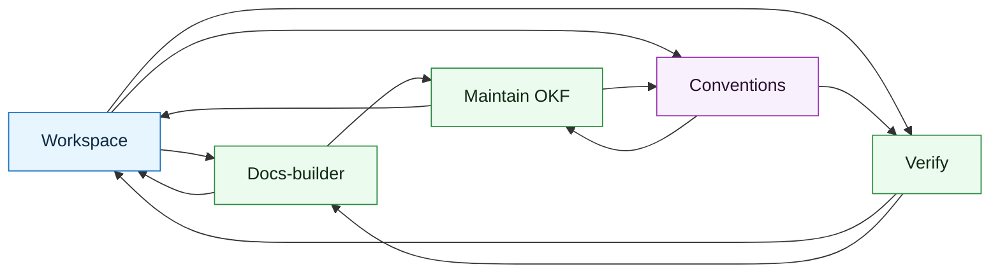

# OKF map

Generated from `.okf/isomer` by `pnpm okf:map`. Do not edit by hand.

- Concepts: 5
- Links: 11
- Isolated concepts: 0

## Graph

## Concepts

- Workspace (Concept): `workspace/concepts/workspace`
- Docs-builder (Playbook): `workspace/playbooks/docs-builder`
- Maintain OKF (Playbook): `workspace/playbooks/maintain-okf`
- Verify (Playbook): `workspace/playbooks/verify`
- Conventions (Reference): `workspace/reference/conventions`
