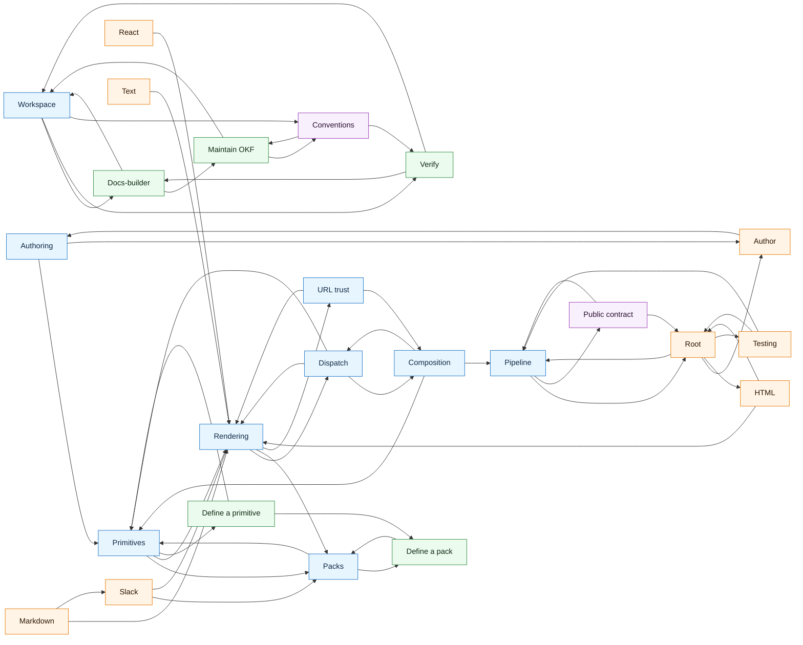

# OKF map

Generated from `.okf/isomer` by `pnpm okf:map`. Do not edit by hand.

- Concepts: 24
- Links: 51
- Isolated concepts: 0

## Graph

## Concepts

- Authoring (Concept): `sdk/concepts/authoring`
- Composition (Concept): `sdk/concepts/composition`
- Dispatch (Concept): `sdk/concepts/dispatch`
- Packs (Concept): `sdk/concepts/packs`
- Pipeline (Concept): `sdk/concepts/pipeline`
- Primitives (Concept): `sdk/concepts/primitives`
- Rendering (Concept): `sdk/concepts/rendering`
- URL trust (Concept): `sdk/concepts/url-trust`
- Author (Entry Point): `sdk/entry-points/author`
- HTML (Entry Point): `sdk/entry-points/html`
- Markdown (Entry Point): `sdk/entry-points/markdown`
- React (Entry Point): `sdk/entry-points/react`
- Root (Entry Point): `sdk/entry-points/root`
- Slack (Entry Point): `sdk/entry-points/slack`
- Testing (Entry Point): `sdk/entry-points/testing`
- Text (Entry Point): `sdk/entry-points/text`
- Define a pack (Playbook): `sdk/playbooks/define-a-pack`
- Define a primitive (Playbook): `sdk/playbooks/define-a-primitive`
- Public contract (Reference): `sdk/reference/public-contract`
- Workspace (Concept): `workspace/concepts/workspace`
- Docs-builder (Playbook): `workspace/playbooks/docs-builder`
- Maintain OKF (Playbook): `workspace/playbooks/maintain-okf`
- Verify (Playbook): `workspace/playbooks/verify`
- Conventions (Reference): `workspace/reference/conventions`
