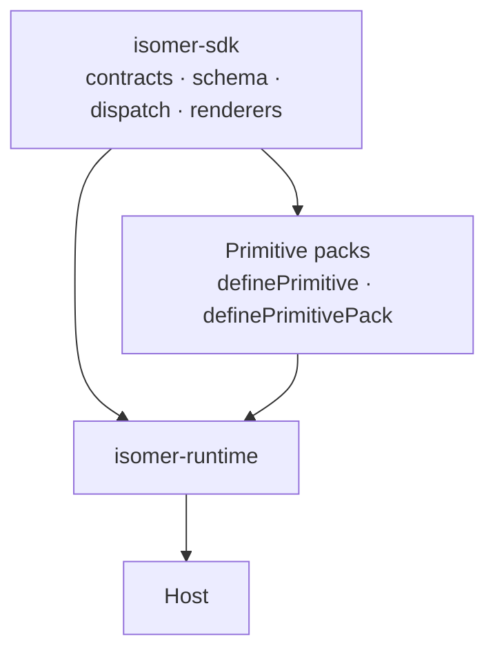

# Isomer SDK

`@elastic/isomer-sdk` is the machinery every other Isomer package is built from. It owns two contracts — what a primitive is, and what a pack is — plus the `Composition` schema, the validator, the dispatcher, the envelopes for four of the six surfaces, the URL trust policy, the agent-authoring toolkit, and the pack test harness.

It composes nothing. Turning packs into a runtime is `@elastic/isomer-runtime`'s job; supplying primitives and renderers is a pack's. This package is what both are written against.



## Who reads this

Pack authors, mostly. If you are writing primitives, a theme, or a frame, this is your API. Hosts meet the SDK for the handful of types the runtime does not re-export.

## Start here

| Page | What it covers |
| --- | --- |
| [Quick start](quick-start.md) | A primitive and a pack from scratch, rendering on four of the six surfaces |
| [Primitives](primitives.md) | The primitive contract: schema, catalog, renderers, and the optional hooks |
| [Packs](packs.md) | The pack contract: declared surfaces, enhancements, picture types |
| [Composition and validation](composition.md) | `Composition`, schema composition, validate vs parse, JSON Schema |
| [Dispatch](dispatch.md) | How a node reaches its renderer, and what happens when one is missing |
| [Rendering](rendering.md) | The envelopes, the HTML renderer, style adapters, enhancements |
| [Frame](frame.md) | The document contract a `snapshot` render is drawn inside |
| [URL trust](url-trust.md) | The one policy every URL-bearing field goes through |
| [Authoring](authoring.md) | JSX and agent prompt assembly |
| [API reference](api.md) | Every entry point and what it exports |

## Entry points

Eight subpaths, split by what a consumer is willing to load:

| Entry | Pulls in | Typical consumer |
| --- | --- | --- |
| `.` | zod, React, and the GFM parser and serializer | everyone — contracts, schema, validation, dispatch |
| `./html` | React, `react-dom/server`, and a JavaScript parser | the HTML surface, a pack's HTML entry |
| `./text` | nothing | text envelopes |
| `./markdown` | zod and the GFM parser and serializer | markdown envelopes and formatting |
| `./slack` | zod and the GFM parser and serializer | Block Kit types, limits, asset collection |
| `./react` | React | React content helpers and dispatcher context |
| `./author` | React | JSX front end, agent prompts |
| `./testing` | Node built-ins | pack conformance harness |

A Slack bot or an MCP server can use the surface-specific subpaths without loading a DOM renderer. Root consumers load React because the dispatcher owns the mandatory React renderer and the `snapshot` path that reuses it.

## Package facts

```sh
npm install @elastic/isomer-sdk react zod
```

`zod` and `react` are required peers. `react-dom` is optional and needed by `./html`. The GFM parser and serializer (`mdast-util-from-markdown`, `mdast-util-to-markdown`, `mdast-util-gfm`, `micromark-extension-gfm`) and `acorn` are ordinary dependencies, installed with the package. It ships as ESM and CommonJS, with `typesVersions` so a `Node10` resolver finds each subpath's types. Only `./testing` touches Node built-ins. On Node it needs 22.13.0 or later, the first 22.x release whose `require()` loads an ES module without a warning. The SDK must not import the runtime.
