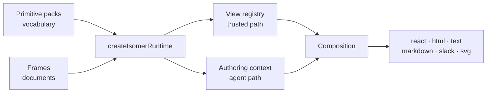

# Isomer runtime

`@elastic/isomer-runtime` turns primitive packs into a working runtime. You give it a vocabulary (packs) and, optionally, the documents it may draw (frames); it gives you a validator, a parser, six render surfaces, a view registry, and the payload an agent authors against.

It renders nothing itself. Primitives, renderers, themes, and frames come from packs and theme packages; the composition schema, dispatcher, and envelopes come from [`@elastic/isomer-sdk`](../../isomer-sdk/docs/index.md); data, authorization, and delivery stay with the host. This package holds those pieces in an arrangement that works and refuses the ones that cannot.

## When you need it

Reach for this package when a host has to render the same answer to more than one channel, or when an agent has to compose a composition that a host will then render. A single-surface React app can render a composition through a pack directly; everything else wants a runtime, because the runtime is what keeps one validator, one inventory, and one set of renderers in agreement.

## Start here

| Page | What it covers |
| --- | --- |
| [Quick start](quick-start.md) | A working host, with rendered output on six channels |
| [Runtime](runtime.md) | `createIsomerRuntime`, its options, and what it refuses |
| [Packs](packs.md) | The vocabulary — what a pack contributes and how packs compose |
| [Frame](frame.md) | The document an image is drawn as, and how a render picks one |
| [Surfaces](surfaces.md) | The six render targets and their validation postures |
| [Embedding](embedding.md) | Isolating a rendered composition's CSS inside a host page |
| [View registry](view-registry.md) | Registering product-owned views and requesting them by id |
| [Authoring context](authoring-context.md) | What an agent is handed, and how its output comes back |
| [Renderer overrides](renderer-overrides.md) | Replacing one renderer without forking a pack |
| [API reference](api.md) | Every export, option, and error |

## Package facts

Source lives under `assemble/`, `registry/`, and `surfaces/`. `@elastic/isomer-sdk` is a workspace dependency. `zod`, `react`, and `react-dom` (`>=18 <20`) are peers — required, because the root entry always constructs the `react` and `html` surfaces, and `html` loads `react-dom/server`. No Node built-ins, so the package runs in a browser, on a server, or in an edge function. One entry point.
