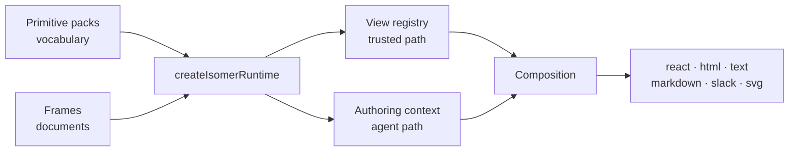

---
title: Isomer runtime
description: Assembles packs and frames into a validator, a parser, the render surfaces, a view registry, and the authoring context.
url: https://docs-v3-preview.elastic.dev/pr-preview/pr-1/runtime
---

# Isomer runtime
`@elastic/isomer-runtime` turns primitive packs into a working runtime. You give it a vocabulary (packs) and, optionally, the documents it may draw (frames); it gives you a validator, a parser, six render surfaces, a view registry, and the payload an agent authors against.
It renders nothing itself. Primitives, renderers, themes, and frames come from packs and theme packages; the composition schema, dispatcher, and envelopes come from [`@elastic/isomer-sdk`](https://docs-v3-preview.elastic.dev/pr-preview/pr-1/sdk); data, authorization, and delivery stay with the host. This package holds those pieces in an arrangement that works and refuses the ones that cannot.

## When you need it

Reach for this package when a host has to render the same answer to more than one channel, or when an agent has to compose a composition that a host will then render. A single-surface React app can render a composition through a pack directly; everything else wants a runtime, because the runtime is what keeps one validator, one inventory, and one set of renderers in agreement.

## Start here

| Page                                                                                                 | What it covers                                                 |
|------------------------------------------------------------------------------------------------------|----------------------------------------------------------------|
| [Quick start](https://docs-v3-preview.elastic.dev/pr-preview/pr-1/runtime/quick-start)               | A working host, with rendered output on six channels           |
| [Runtime](https://docs-v3-preview.elastic.dev/pr-preview/pr-1/runtime/runtime)                       | `createIsomerRuntime`, its options, and what it refuses        |
| [Packs](https://docs-v3-preview.elastic.dev/pr-preview/pr-1/runtime/packs)                           | The vocabulary — what a pack contributes and how packs compose |
| [Frame](https://docs-v3-preview.elastic.dev/pr-preview/pr-1/runtime/frame)                           | The document an image is drawn as, and how a render picks one  |
| [Surfaces](https://docs-v3-preview.elastic.dev/pr-preview/pr-1/runtime/surfaces)                     | The six render targets and their validation postures           |
| [Embedding](https://docs-v3-preview.elastic.dev/pr-preview/pr-1/runtime/embedding)                   | Isolating a rendered composition's CSS inside a host page      |
| [View registry](https://docs-v3-preview.elastic.dev/pr-preview/pr-1/runtime/view-registry)           | Registering product-owned views and requesting them by id      |
| [Authoring context](https://docs-v3-preview.elastic.dev/pr-preview/pr-1/runtime/authoring-context)   | What an agent is handed, and how its output comes back         |
| [Renderer overrides](https://docs-v3-preview.elastic.dev/pr-preview/pr-1/runtime/renderer-overrides) | Replacing one renderer without forking a pack                  |
| [API reference](https://docs-v3-preview.elastic.dev/pr-preview/pr-1/runtime/api)                     | Every export, option, and error                                |

## Package facts

Source lives under `assemble/`, `registry/`, and `surfaces/`. `@elastic/isomer-sdk` is a workspace dependency. `zod`, `react`, and `react-dom` (`>=18 <20`) are peers — required, because the root entry always constructs the `react` and `html` surfaces, and `html` loads `react-dom/server`. No Node built-ins, so the package runs in a browser, on a server, or in an edge function. One entry point.