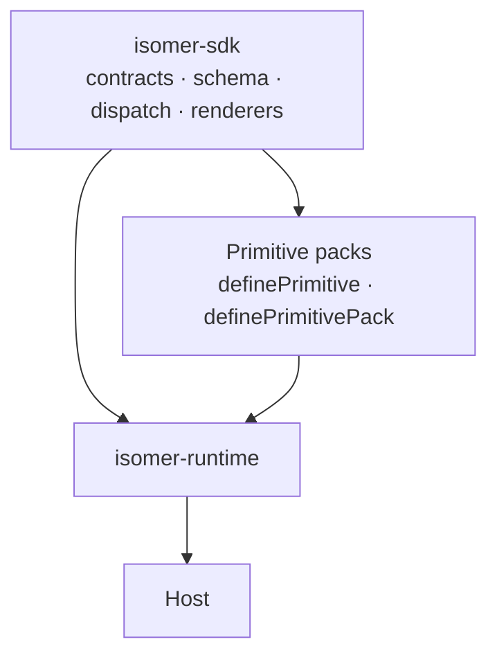

---
title: Isomer SDK
description: The contracts every Isomer package is written against: primitives, packs, composition, validation, dispatch, envelopes, URL trust, authoring, and the conformance harness.
url: https://docs-v3-preview.elastic.dev/pr-preview/pr-1/sdk
---

# Isomer SDK
`@elastic/isomer-sdk` is the machinery every other Isomer package is built from. It owns two contracts — what a primitive is, and what a pack is — plus the `Composition` schema, the validator, the dispatcher, the envelopes for four of the six surfaces, the URL trust policy, the agent-authoring toolkit, and the pack test harness.
It composes nothing. Turning packs into a runtime is `@elastic/isomer-runtime`'s job; supplying primitives and renderers is a pack's. This package is what both are written against.

## Who reads this

Pack authors, mostly. If you are writing primitives, a theme, or a frame, this is your API. Hosts meet the SDK for the handful of types the runtime does not re-export.

## Start here

| Page                                                                                              | What it covers                                                             |
|---------------------------------------------------------------------------------------------------|----------------------------------------------------------------------------|
| [Quick start](https://docs-v3-preview.elastic.dev/pr-preview/pr-1/sdk/quick-start)                | A primitive and a pack from scratch, rendering on four of the six surfaces |
| [Primitives](https://docs-v3-preview.elastic.dev/pr-preview/pr-1/sdk/primitives)                  | The primitive contract: schema, catalog, renderers, and the optional hooks |
| [Packs](https://docs-v3-preview.elastic.dev/pr-preview/pr-1/sdk/packs)                            | The pack contract: declared surfaces, enhancements, picture types          |
| [Composition and validation](https://docs-v3-preview.elastic.dev/pr-preview/pr-1/sdk/composition) | `Composition`, schema composition, validate vs parse, JSON Schema          |
| [Dispatch](https://docs-v3-preview.elastic.dev/pr-preview/pr-1/sdk/dispatch)                      | How a node reaches its renderer, and what happens when one is missing      |
| [Rendering](https://docs-v3-preview.elastic.dev/pr-preview/pr-1/sdk/rendering)                    | The envelopes, the HTML renderer, style adapters, enhancements             |
| [Frame](https://docs-v3-preview.elastic.dev/pr-preview/pr-1/sdk/frame)                            | The document contract an `svg` render is drawn inside                      |
| [URL trust](https://docs-v3-preview.elastic.dev/pr-preview/pr-1/sdk/url-trust)                    | The one policy every URL-bearing field goes through                        |
| [Authoring](https://docs-v3-preview.elastic.dev/pr-preview/pr-1/sdk/authoring)                    | JSX, object builders, and agent prompt assembly                            |
| [API reference](https://docs-v3-preview.elastic.dev/pr-preview/pr-1/sdk/api)                      | Every entry point and what it exports                                      |

## Entry points

Eight subpaths, split by what a consumer is willing to load:

| Entry        | Pulls in                     | Typical consumer                                   |
|--------------|------------------------------|----------------------------------------------------|
| `.`          | zod and React runtimes       | everyone — contracts, schema, validation, dispatch |
| `./html`     | React and `react-dom/server` | the HTML surface, a pack's HTML entry              |
| `./text`     | nothing beyond zod           | text envelopes and formatting                      |
| `./markdown` | nothing beyond zod           | markdown envelopes and formatting                  |
| `./slack`    | nothing beyond zod           | Block Kit types, limits, asset collection          |
| `./react`    | react                        | React content helpers and dispatcher context       |
| `./author`   | React                        | JSX/builders front ends, agent prompts             |
| `./testing`  | Node assert                  | pack conformance harness                           |

A Slack bot or an MCP server can use the surface-specific subpaths without loading a DOM renderer or the TypeScript compiler. Root consumers load React because the dispatcher owns the mandatory React renderer and the SVG path that reuses it.

## Package facts

`zod` and `react` are required peers. `react-dom` is optional and needed by `./html`. Only `./testing` touches Node built-ins. The SDK must not import the runtime.